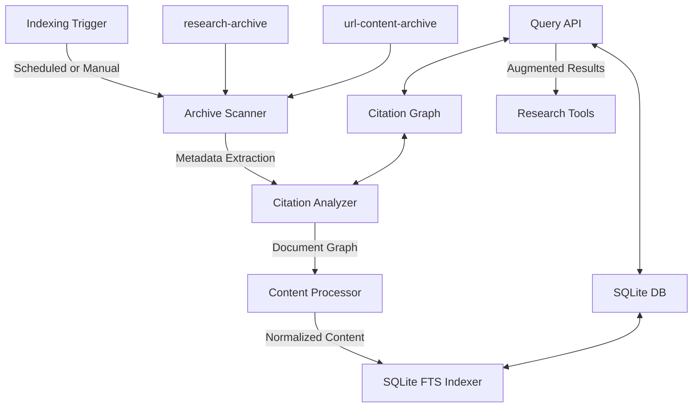

# Search Indexing Element

## Purpose
This document serves as the index for all specifications and documentation related to the search indexing system.

## Classification
- **Domain:** Structure
- **Stability:** Semi-stable
- **Abstraction:** Structural
- **Confidence:** Established

## Content

### Overview

The search indexing system provides a file-based indexing solution for the Research MCP's archived content, enabling efficient search and retrieval of previously collected research without requiring an external server. The system focuses on quality over performance, implements periodic indexing rather than real-time, and emphasizes citation traceability.

### Key Components



### Documentation Index

#### Core Architecture

- [Structure](structure.md) - Overall architecture and design of the search indexing system
- [Implementation Plan](../../planning/search_indexing_implementation_plan.md) - Detailed implementation plan with phases and tasks
- [Implementation Guide](implementation_guide.md) - Step-by-step guide for implementing the search indexing system

#### Module Specifications

- [Types Specification](types_specification.md) - TypeScript interfaces used throughout the system
- [Database Specification](database_specification.md) - SQLite database module with FTS5 support
- [Archive Scanner Specification](archive_scanner_specification.md) - Module for scanning research and URL content archives
- [Content Processor Specification](content_processor_specification.md) - Module for normalizing and processing content
- [Citation Graph Specification](citation_graph_specification.md) - Module for building and querying citation relationships
- [Search API Specification](search_api_specification.md) - API for searching the index and retrieving results
- [Indexing Trigger Specification](indexing_trigger_specification.md) - Module for scheduling and triggering indexing
- [Index Module Specification](index_module_specification.md) - Main entry point for the search indexing system
- [MCP Tool Specification](mcp_tool_specification.md) - MCP tool for exposing search functionality to AI assistants

#### Additional Documentation

- [Package Specification](package_specification.md) - Required dependencies for the search indexing system
- [Implementation Update](../../meta/updates/infrastructure/search_indexing_implementation.md) - Status update on the implementation

### Implementation Status

The search indexing system is currently in the planning and specification phase. The detailed specifications for all components have been created, and the implementation plan has been established. The next step is to begin the actual implementation according to the phases outlined in the implementation plan.

### Usage Examples

#### Basic Search

```typescript
// Initialize the search index
const searchIndex = await createSearchIndex();

// Search for documents
const results = searchIndex.search({
  query: "machine learning",
  fuzzy: true,
  limit: 10
});

// Display results
console.log(`Found ${results.length} results:`);
for (const result of results) {
  console.log(`- ${result.document.title} (Score: ${result.document.score})`);
}
```

#### Citation-Aware Search

```typescript
// Search with citation information
const results = searchIndex.search({
  query: "neural networks",
  includeCitations: true,
  citationDepth: 2
});

// Display results with citations
for (const result of results) {
  console.log(`- ${result.document.title}`);
  
  if (result.citations) {
    console.log(`  Cited by ${result.citations.citing.length} documents`);
    console.log(`  Cites ${result.citations.cited.length} documents`);
  }
}
```

#### MCP Tool Usage

```json
// Example MCP tool request
{
  "name": "searchLocalArchives",
  "inputs": {
    "query": "artificial intelligence",
    "fuzzy": true,
    "includeCitations": true,
    "limit": 5
  }
}
```

## Relationships
- **Parent Nodes:** [foundation/structure.md](../../foundation/structure.md) - is-child-of - Overall project structure
- **Child Nodes:** None
- **Related Nodes:** 
  - [elements/research_tools] - interfaces-with - Research tools using the search index
  - [planning/roadmap.md](../../planning/roadmap.md) - implements - Fulfills the roadmap goal of searchable archives

## Navigation Guide
- **When to Use:** When working with or implementing the search indexing system
- **Next Steps:** Review the implementation plan and begin implementation
- **Related Tasks:** Database setup, citation analysis, MCP tool integration

## Metadata
- **Created:** May 26, 2025
- **Last Updated:** May 26, 2025
- **Updated By:** Cline Agent

## Change History
- May 26, 2025: Initial creation of search indexing element index