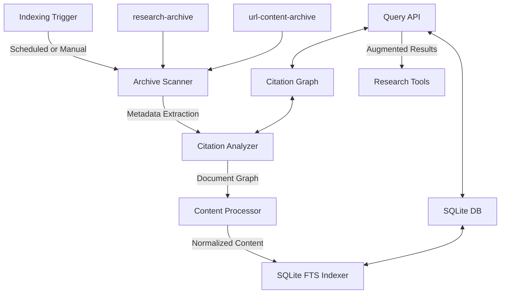

# Search Indexing Structure

## Purpose
This document defines the architecture and implementation details for the file-based search indexing system that will be used to make research-archive and url-content-archive contents searchable and usable for augmenting future research requests.

## Classification
- **Domain:** Structure
- **Stability:** Semi-stable
- **Abstraction:** Structural
- **Confidence:** Evolving

## Content

### Overview

The search indexing system provides a file-based indexing solution for the Research MCP's archived content, enabling efficient search and retrieval of previously collected research without requiring an external server. The system focuses on quality over performance, implements periodic indexing rather than real-time, and emphasizes citation traceability.



### Key Components

#### 1. SQLite with FTS5 Database
The core of the indexing solution is an SQLite database with FTS5 (Full-Text Search) extensions, providing:
- Excellent relevance ranking with configurable tokenizers
- Explicit relationship modeling between documents and citations
- Support for batch operations and incremental updates
- Scalability from kilobytes to many gigabytes within a single file-based database

#### 2. Citation Graph Builder
A specialized component that builds and maintains relationships between documents:
- Extracts explicit citations from research reports
- Matches URLs between research archive and url-content archive
- Detects implicit citations through text similarity
- Provides an API for traversing citation relationships

#### 3. Periodic Indexing System
A mechanism for triggering index updates:
- Can run on a schedule or be manually triggered
- Scans archives for changes since the last indexing run
- Processes only new or modified content
- Updates the SQLite database in efficient transactions

#### 4. Search API
An interface for querying the indexed content:
- Supports full-text search with relevance ranking
- Enhances results with citation context
- Finds related documents through the citation graph
- Provides integration points for the MCP tools

### Database Schema

```sql
-- Document metadata table
CREATE TABLE documents (
  id TEXT PRIMARY KEY,
  title TEXT,
  path TEXT NOT NULL,
  source TEXT NOT NULL,  -- 'research' or 'url-content'
  type TEXT NOT NULL,    -- 'report', 'search', 'webpage', etc.
  date TEXT NOT NULL,
  metadata TEXT          -- JSON blob for flexible metadata
);

-- Full-text search virtual table
CREATE VIRTUAL TABLE document_content USING fts5(
  id UNINDEXED,          -- Reference to documents table
  title,                 -- Higher weight in searches
  content,               -- Main searchable content
  query,                 -- Original research query if applicable
  tokenize='porter unicode61 remove_diacritics 1'
);

-- Citation relationships table
CREATE TABLE citations (
  id TEXT PRIMARY KEY,
  source_id TEXT NOT NULL,
  target_url TEXT NOT NULL,
  target_id TEXT,        -- May be NULL if citing external content
  context TEXT,          -- Text surrounding the citation
  confidence REAL,       -- 0.0-1.0 confidence score
  FOREIGN KEY(source_id) REFERENCES documents(id),
  FOREIGN KEY(target_id) REFERENCES documents(id)
);

-- Citation search index
CREATE VIRTUAL TABLE citation_content USING fts5(
  id UNINDEXED,
  context,               -- The citation context is searchable
  tokenize='porter unicode61 remove_diacritics 1'
);

-- Create indices for fast lookups
CREATE INDEX idx_citations_source ON citations(source_id);
CREATE INDEX idx_citations_target_id ON citations(target_id);
CREATE INDEX idx_citations_target_url ON citations(target_url);
```

### Core Classes and Interfaces

#### Citation Graph

```typescript
interface Citation {
  sourceId: string;         // ID of the citing document
  targetUrl: string;        // URL being cited
  targetId?: string;        // ID of the cited document (if in our archives)
  context: string;          // Text surrounding the citation
  confidence: number;       // Confidence score (1.0 = explicit link)
}

class CitationGraph {
  // Build citation relationships between documents
  buildFromArchives(researchPath: string, urlContentPath: string): Citation[] {
    // Extract explicit citations from research reports
    // Match URLs between research archive and url-content archive
    // Detect implicit citations through text similarity
    // Return comprehensive citation network
  }
  
  // Find all documents citing a specific source
  findCitations(documentId: string): Citation[] {}
  
  // Find all sources cited by a document
  findReferences(documentId: string): Citation[] {}
  
  // Export citation graph to visualization format
  exportGraph(format: 'json'|'graphml'|'dot'): string {}
}
```

#### Archive Indexer

```typescript
class ArchiveIndexer {
  private db: Database;
  private citationGraph: CitationGraph;
  
  constructor(dbPath: string) {
    this.db = new Database(dbPath);
    this.citationGraph = new CitationGraph();
    this.setupSchema();
  }
  
  // Run full indexing job
  async indexArchives(options: {
    researchPath: string,
    urlContentPath: string,
    force?: boolean     // Force reindex even if unchanged
  }): Promise<IndexingStats> {
    // 1. Scan archives for changes since last index
    // 2. Extract and normalize content from changed files
    // 3. Build citation graph
    // 4. Update SQLite database in a transaction
    // 5. Return statistics about the indexing job
  }
  
  // Set up indexing triggers
  setupTriggers(options: {
    schedule?: string,  // Cron expression for scheduled indexing
    watchFiles?: boolean // Watch for file changes
  }): void {
    // Configure periodic or event-based triggering
  }
}
```

#### Search API

```typescript
interface SearchOptions {
  query: string;
  fuzzy?: boolean;
  fields?: ('title'|'content'|'query')[];
  limit?: number;
  includeCitations?: boolean;  // Include citation relationships
  citationDepth?: number;      // How many levels of citations to include
}

interface SearchResult {
  document: {
    id: string;
    title: string;
    path: string;
    source: 'research'|'url-content';
    date: string;
    score: number;
  };
  matches: {
    field: string;
    term: string;
    snippets: string[];
  }[];
  citations?: {
    citing: Citation[];    // Documents citing this one
    cited: Citation[];     // Documents cited by this one
  };
}

class SearchAPI {
  // Perform search with citation awareness
  search(options: SearchOptions): SearchResult[] {
    // Execute FTS query with ranking
    // Enhance results with citation data if requested
    // Return comprehensive results
  }
  
  // Find related documents through citation graph
  findRelated(documentId: string, depth: number = 1): SearchResult[] {
    // Use citation graph to find related documents
  }
  
  // Generate citation report for a document
  generateCitationReport(documentId: string): CitationReport {
    // Analyze citation patterns
    // Generate metrics and visualizations
  }
}
```

### MCP Integration

The search index will be exposed through a new MCP tool:

```typescript
// New MCP tool definition
export const searchLocalArchives: Tool = {
  name: 'searchLocalArchives',
  description: 'Searches the local research and URL content archives',
  inputSchema: {
    type: 'object',
    properties: {
      query: {
        type: 'string',
        description: 'The search query'
      },
      includeCitations: {
        type: 'boolean',
        description: 'Whether to include citation information'
      }
    },
    required: ['query']
  },
  handler: async (inputs, context) => {
    const { query, includeCitations = false } = inputs;
    
    const searchApi = new SearchAPI(DB_PATH);
    const results = searchApi.search({
      query,
      includeCitations,
      fuzzy: true
    });
    
    return {
      results,
      // Include citation visualization if appropriate
      citationGraph: includeCitations ? 
        searchApi.generateCitationVisualization(results.map(r => r.document.id)) : 
        undefined
    };
  }
};
```

Existing research tools will be modified to:
- Check the local index before making API calls when appropriate
- Augment API responses with local results when relevant
- Include citation information with results

### Implementation Timeline

1. **Phase 1: Core Indexing** (1-2 days)
   - Implement SQLite schema
   - Create basic document indexer
   - Build simple search API

2. **Phase 2: Citation Analysis** (2-3 days)
   - Implement citation extraction
   - Build citation graph
   - Create citation-aware search features

3. **Phase 3: Integration** (1-2 days)
   - Create MCP tool for local search
   - Integrate with existing research tools
   - Implement periodic indexing triggers

4. **Phase 4: Refinement** (1-2 days)
   - Tune relevance ranking
   - Optimize indexing performance
   - Add visualization capabilities

### Technical Considerations

#### Performance
- SQLite with FTS5 provides efficient full-text search capabilities
- Periodic indexing avoids impacting runtime performance
- The citation graph enables efficient relationship traversal

#### Scalability
- SQLite can handle databases up to many gigabytes in size
- The design supports incremental updates for growing archives
- Index structures are optimized for efficient query performance

#### Maintainability
- Modular architecture with clear separation of concerns
- Strong typing with TypeScript
- Comprehensive test coverage

#### Security
- No external network dependencies
- File permissions controlled by the host environment
- Input validation to prevent SQL injection

## Relationships
- **Parent Nodes:** [foundation/structure.md] - is-child-of - Overall project structure
- **Child Nodes:** None yet
- **Related Nodes:** 
  - [elements/research_tools] - interfaces-with - Research tools using the search index
  - [planning/roadmap.md] - implements - Fulfills the roadmap goal of searchable archives

## Navigation Guide
- **When to Use:** When implementing or modifying the search indexing functionality
- **Next Steps:** For implementation, see the detailed phases in the timeline section
- **Related Tasks:** Building MCP tools, archive management, citation analysis

## Metadata
- **Created:** May 26, 2025
- **Last Updated:** May 26, 2025
- **Updated By:** Cline Agent

## Change History
- May 26, 2025: Initial creation of search indexing structure document
