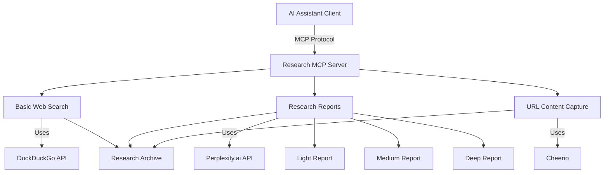

# Project Structure

## Purpose
This document provides an overview of the Research MCP project structure, including key elements, their relationships, and the principles guiding their design.

## Classification
- **Domain:** Structure
- **Stability:** Semi-stable
- **Abstraction:** Structural
- **Confidence:** Established

## Content

### Structure Overview

The Research MCP project is structured as an MCP server implementation built with FastMCP, a TypeScript framework for developing Model Context Protocol servers. The system provides various research tools through a standard MCP interface, enabling AI assistants to perform web searches, generate research reports, and capture web content.



### Key Elements

#### MCP Server
The core server component built on FastMCP that implements the Model Context Protocol and exposes various research tools as MCP tools. It handles client connections, processes tool requests, and manages the execution of research operations.

#### Research Tools
A collection of specialized tools for performing different types of research operations:

1. **Basic Web Search**: A simple web search tool that uses DuckDuckGo to perform general web queries and return results.

2. **Research Reports**: A set of tools for generating detailed research content using Perplexity.ai:
   - **Light Research Report**: Generates brief, high-level research summaries using Perplexity's Sonar model.
   - **Medium Research Report**: Generates moderately detailed research reports using Perplexity's Sonar Medium model.
   - **Deep Research Report**: Generates comprehensive research reports using Perplexity's Sonar Deep Research API.

3. **URL Content Capture**: A tool for capturing content from web pages and converting it to Markdown format. Supports HTML, PDF, and DOCX documents.

#### Research Archive
A system for storing and organizing all research outputs, including search results, research reports, and captured URL content. This provides a foundation for future indexing and search capabilities.

### Element Interactions

1. **Client-Server Interaction**: AI assistants connect to the Research MCP server via the MCP protocol, sending tool requests and receiving responses.

2. **Tool-API Interaction**: Each research tool interacts with its respective API:
   - Basic Web Search uses DuckDuckGo for web queries
   - Research Reports use Perplexity.ai API for generating content
   - URL Content Capture uses Cheerio and other parsers for content extraction

3. **Tool-Archive Interaction**: All research tools store their outputs in the Research Archive for future reference and use.

4. **Internal Tool Dependencies**: The Research Reports tools share common base functionality through a shared baseResearchReport module.

### Technical Architecture

The project follows a clean architecture with the following organization:

```
src/
├── index.ts                # Entry point for the application
├── server.ts               # MCP server implementation
└── tools/                  # Individual MCP tools
    ├── basicWebSearch.ts   # Basic web search implementation
    ├── captureUrlContent.ts # URL content capture implementation
    ├── deepResearchReport.ts # Deep research report implementation
    ├── lightResearchReport.ts # Light research report implementation
    ├── mediumResearchReport.ts # Medium research report implementation
    └── base/
        └── baseResearchReport.ts # Shared functionality for research reports
```

### Technologies and Methods

| Area | Technologies/Methods | Justification |
|-------|--------------|---------------|
| Framework | FastMCP | Provides a structured approach to implementing MCP servers with TypeScript |
| Research Reports | Perplexity.ai API | Offers powerful AI models specifically designed for research tasks |
| Web Search | DuckDuckGo | Provides reliable search results without the complexity of direct search engine integration |
| Content Extraction | Cheerio, PDF/DOCX parsers | Enables efficient extraction of content from various document formats |
| Protocol | MCP (SSE Transport) | Standard protocol for AI tool integration, allowing seamless use by assistants |
| Development | TypeScript, Node.js | Type safety, modern JavaScript features, and robust ecosystem |
| Storage | File-based archiving | Simple, reliable storage of research outputs without database dependencies |

### Implementation Characteristics

#### Quality
The system ensures high-quality research outputs by leveraging Perplexity.ai's specialized AI models and providing structured data through careful processing and formatting.

#### Scalability
The architecture supports scalability in several dimensions:
- Tool set can be expanded with additional research capabilities
- Archive system can grow to accommodate increasing amounts of research data
- Processing can be distributed if needed for higher throughput

#### Security
Security considerations include:
- API key management for third-party services
- Rate limiting to prevent abuse
- Proper error handling to avoid information leakage
- Environment-based configuration to separate sensitive information

#### Reliability
The system enhances reliability through:
- Error handling and retry mechanisms for API calls
- Validation of inputs and outputs
- Consistent archiving of all research data
- Configurability for different environments

#### Maintainability
The codebase is designed for maintainability with:
- Modular architecture with clear separation of concerns
- Shared base functionality to reduce duplication
- Strong typing with TypeScript
- Consistent coding patterns across tools

### Future Evolution

The Research MCP is designed to evolve in the following areas:

1. **Indexing and Search**: Building advanced search capabilities for the research archive to enable efficient retrieval of previously gathered information.

2. **Pre-searching**: Implementing proactive research on common queries to reduce latency for frequently requested information.

3. **Additional Research Tools**: Extending the tool set with specialized research capabilities for specific domains.

4. **Enhanced Content Extraction**: Improving the ability to extract content from complex web pages and additional document formats.

5. **Structured Data Integration**: Adding capabilities to work with structured data sources and APIs beyond general web content.

## Relationships
- **Parent Nodes:** [foundation/project_definition.md]
- **Child Nodes:** 
  - [elements/*/structure.md] - details - Element-specific structural details
  - [decisions/*] - justifies - Key decisions that shaped this structure
- **Related Nodes:** 
  - [foundation/principles.md] - guides - Principles that guided structural decisions
  - [connections/dependencies.md] - details - Dependencies between elements
  - [connections/interfaces.md] - specifies - Interfaces between elements

## Navigation Guidance
- **Access Context:** Use this document when needing to understand the overall Research MCP system architecture and design
- **Common Next Steps:** After reviewing this structure, typically explore specific element structures or decision records
- **Related Tasks:** Project design, element development, integration planning
- **Update Patterns:** This document should be updated when there are significant changes to the project structure or methodology

## Metadata
- **Created:** May 21, 2025
- **Last Updated:** May 21, 2025
- **Updated By:** Cline Agent

## Change History
- May 21, 2025: Updated structure document with comprehensive details about Research MCP implementation
