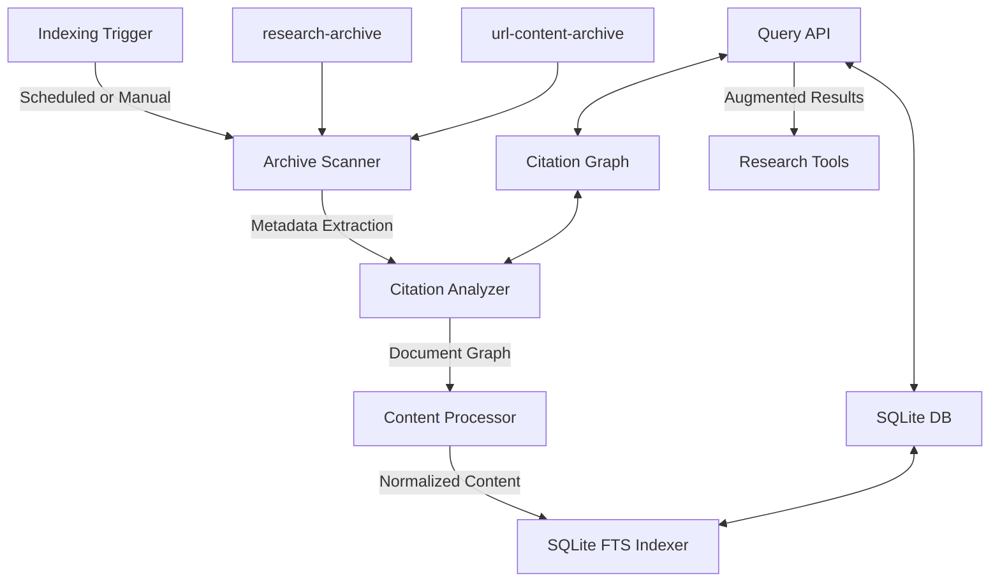

# Search Indexing Implementation

## Purpose
This document details the addition of a file-based search indexing system to the Research MCP project, which allows for the indexing and searching of research-archive and url-content-archive contents.

## Classification
- **Domain:** Infrastructure
- **Stability:** Semi-stable
- **Abstraction:** Detailed
- **Confidence:** Evolving

## Content

### Overview
A comprehensive file-based search indexing solution has been designed to make the archived research content searchable and usable for augmenting future research requests. The solution uses SQLite with FTS5 (Full-Text Search) extensions as the core indexing and search engine, with specialized components for citation analysis and traceability.

### Key Components
1. **SQLite with FTS5 Database** - Provides excellent relevance ranking with configurable tokenizers and explicit relationship modeling between documents and citations
2. **Citation Graph Builder** - Extracts and maintains relationships between documents
3. **Periodic Indexing System** - Triggers index updates on a schedule or manually
4. **Search API** - Provides an interface for querying indexed content

### Implementation Details
The implementation follows a modular architecture with clear separation of concerns:

The system is designed with the following priorities:
- Quality over performance
- Periodic indexing rather than real-time
- Citation traceability
- File-based storage without external server requirements

### Implementation Timeline
1. **Phase 1: Core Indexing** (1-2 days)
2. **Phase 2: Citation Analysis** (2-3 days)
3. **Phase 3: Integration** (1-2 days)
4. **Phase 4: Refinement** (1-2 days)

### Technical Decisions
1. **Choice of SQLite with FTS5** - Selected for its excellent full-text search capabilities without requiring an external server
2. **Citation Graph Approach** - Implemented to maintain relationships between documents and enable citation traceability
3. **Periodic Indexing** - Chosen to avoid impacting runtime performance of research tools

## Relationships
- **Parent Nodes:** [meta/updates/infrastructure/index.md]
- **Child Nodes:** None
- **Related Nodes:**
  - [elements/search_indexing/structure.md] - details - Detailed architecture of the search indexing system
  - [foundation/structure.md] - extends - Adds search functionality to the overall project structure

## Navigation
- [Infrastructure Updates Index](index.md)
- [Main Updates Index](../index.md)
- [Search Indexing Structure](../../../elements/search_indexing/structure.md)

## Metadata
- **Created:** 2025-05-26
- **Last Updated:** 2025-05-26
- **Updated By:** Cline Agent

## Change History
- 2025-05-26: Initial creation of search indexing implementation update
