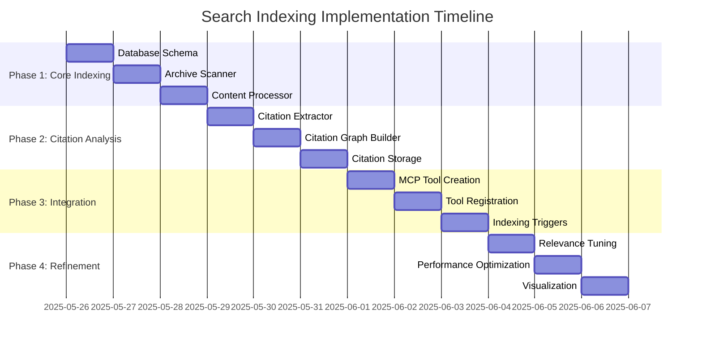

# Search Indexing Implementation Plan

## Purpose
This document outlines the detailed implementation plan for the search indexing feature as defined in the context network. It breaks down the implementation into discrete tasks that can be assigned to specialized agents.

## Classification
- **Domain:** Planning
- **Stability:** Semi-stable
- **Abstraction:** Detailed
- **Confidence:** Established

## Content

### Overview

The search indexing implementation will follow the architecture defined in [elements/search_indexing/structure.md](../elements/search_indexing/structure.md). This plan breaks down the implementation into four phases, each with specific tasks and deliverables.



### Implementation Phases

#### Phase 1: Core Indexing (1-2 days)

**Task 1.1: Database Module Implementation**
- **Objective**: Create a SQLite database module with FTS5 support
- **Context Location**: [elements/search_indexing/structure.md](../elements/search_indexing/structure.md) (Database Schema section)
- **Agent Assignment**: Code
- **Deliverables**:
  - `src/src/search/database.ts` - SQLite database wrapper with schema initialization
  - `src/src/search/types.ts` - TypeScript interfaces for database entities

**Task 1.2: Archive Scanner Implementation**
- **Objective**: Create a module to scan research and URL content archives
- **Context Location**: [elements/search_indexing/structure.md](../elements/search_indexing/structure.md) (Archive Indexer section)
- **Agent Assignment**: Code
- **Deliverables**:
  - `src/src/search/archiveScanner.ts` - Module to scan and extract metadata from archives

**Task 1.3: Content Processor Implementation**
- **Objective**: Create a module to normalize and process content for indexing
- **Context Location**: [elements/search_indexing/structure.md](../elements/search_indexing/structure.md) (Key Components section)
- **Agent Assignment**: Code
- **Deliverables**:
  - `src/src/search/contentProcessor.ts` - Content normalization and processing module

#### Phase 2: Citation Analysis (2-3 days)

**Task 2.1: Citation Extractor Implementation**
- **Objective**: Create a module to extract citations from research reports
- **Context Location**: [elements/search_indexing/structure.md](../elements/search_indexing/structure.md) (Citation Graph section)
- **Agent Assignment**: Code
- **Deliverables**:
  - `src/src/search/citationExtractor.ts` - Module to extract citations from documents

**Task 2.2: Citation Graph Implementation**
- **Objective**: Create a module to build and query the citation graph
- **Context Location**: [elements/search_indexing/structure.md](../elements/search_indexing/structure.md) (Citation Graph section)
- **Agent Assignment**: Code
- **Deliverables**:
  - `src/src/search/citationGraph.ts` - Citation graph builder and query module

**Task 2.3: Citation Storage Implementation**
- **Objective**: Create a module to store and retrieve citations from the database
- **Context Location**: [elements/search_indexing/structure.md](../elements/search_indexing/structure.md) (Database Schema section)
- **Agent Assignment**: Code
- **Deliverables**:
  - `src/src/search/citationStorage.ts` - Citation storage and retrieval module

#### Phase 3: Integration (1-2 days)

**Task 3.1: Search API Implementation**
- **Objective**: Create a search API module for querying the index
- **Context Location**: [elements/search_indexing/structure.md](../elements/search_indexing/structure.md) (Search API section)
- **Agent Assignment**: Code
- **Deliverables**:
  - `src/src/search/searchApi.ts` - Search API module

**Task 3.2: MCP Tool Implementation**
- **Objective**: Create an MCP tool for searching local archives
- **Context Location**: [elements/search_indexing/structure.md](../elements/search_indexing/structure.md) (MCP Integration section)
- **Agent Assignment**: Code
- **Deliverables**:
  - `src/src/tools/searchLocalArchives.ts` - MCP tool implementation
  - Update to `src/src/server.ts` to register the new tool

**Task 3.3: Indexing Trigger Implementation**
- **Objective**: Create a module to trigger indexing on schedule or manually
- **Context Location**: [elements/search_indexing/structure.md](../elements/search_indexing/structure.md) (Periodic Indexing System section)
- **Agent Assignment**: Code
- **Deliverables**:
  - `src/src/search/indexingTrigger.ts` - Indexing trigger module
  - `src/src/search/index.ts` - Main entry point for search indexing system

#### Phase 4: Refinement (1-2 days)

**Task 4.1: Relevance Tuning**
- **Objective**: Tune the search relevance ranking for optimal results
- **Context Location**: [elements/search_indexing/structure.md](../elements/search_indexing/structure.md) (Technical Considerations section)
- **Agent Assignment**: Code
- **Deliverables**:
  - Updates to `src/src/search/searchApi.ts` with improved ranking

**Task 4.2: Performance Optimization**
- **Objective**: Optimize indexing and search performance
- **Context Location**: [elements/search_indexing/structure.md](../elements/search_indexing/structure.md) (Technical Considerations section)
- **Agent Assignment**: Code
- **Deliverables**:
  - Performance improvements across search modules

**Task 4.3: Visualization Implementation**
- **Objective**: Create visualization capabilities for citation graphs
- **Context Location**: [elements/search_indexing/structure.md](../elements/search_indexing/structure.md) (Citation Graph section)
- **Agent Assignment**: Code
- **Deliverables**:
  - `src/src/search/visualization.ts` - Citation graph visualization module

### Dependencies and File Structure

The implementation will create the following file structure:

```
src/src/
├── search/
│   ├── index.ts                # Main entry point for search indexing
│   ├── types.ts                # TypeScript interfaces
│   ├── database.ts             # SQLite database wrapper
│   ├── archiveScanner.ts       # Archive scanning module
│   ├── contentProcessor.ts     # Content processing module
│   ├── citationExtractor.ts    # Citation extraction module
│   ├── citationGraph.ts        # Citation graph builder
│   ├── citationStorage.ts      # Citation storage module
│   ├── searchApi.ts            # Search API module
│   ├── indexingTrigger.ts      # Indexing trigger module
│   └── visualization.ts        # Citation visualization module
└── tools/
    └── searchLocalArchives.ts  # MCP tool for local search
```

### Package Dependencies

The implementation will require the following additional dependencies:

1. **sqlite3** or **better-sqlite3** - For SQLite database access
2. **node-schedule** - For scheduled indexing
3. **d3** or **vis-network** - For citation graph visualization (optional)

### Integration Points

The search indexing system will integrate with:

1. **MCP Server** - Through the new searchLocalArchives tool
2. **Research Tools** - By augmenting results with local archive data
3. **File System** - For accessing research and URL content archives

### Testing Strategy

Each component should be tested individually and as part of the integrated system:

1. **Unit Tests** - For individual modules
2. **Integration Tests** - For database operations and citation analysis
3. **End-to-End Tests** - For the complete indexing and search workflow

### Deployment Considerations

1. **Database Location** - The SQLite database should be stored in a persistent location
2. **Indexing Schedule** - Configure appropriate indexing frequency based on archive update patterns
3. **Resource Usage** - Monitor memory and disk usage during indexing operations

## Relationships
- **Parent Nodes:** [planning/roadmap.md](roadmap.md) - implements - Roadmap goal for searchable archives
- **Child Nodes:** None
- **Related Nodes:** 
  - [elements/search_indexing/structure.md](../elements/search_indexing/structure.md) - details - Detailed architecture
  - [meta/updates/infrastructure/search_indexing_implementation.md](../meta/updates/infrastructure/search_indexing_implementation.md) - documents - Implementation update

## Navigation Guide
- **When to Use:** When implementing the search indexing feature
- **Next Steps:** Begin with Phase 1 tasks, then proceed through subsequent phases
- **Related Tasks:** Database setup, citation analysis, MCP tool integration

## Metadata
- **Created:** May 26, 2025
- **Last Updated:** May 26, 2025
- **Updated By:** Cline Agent

## Change History
- May 26, 2025: Initial creation of search indexing implementation plan